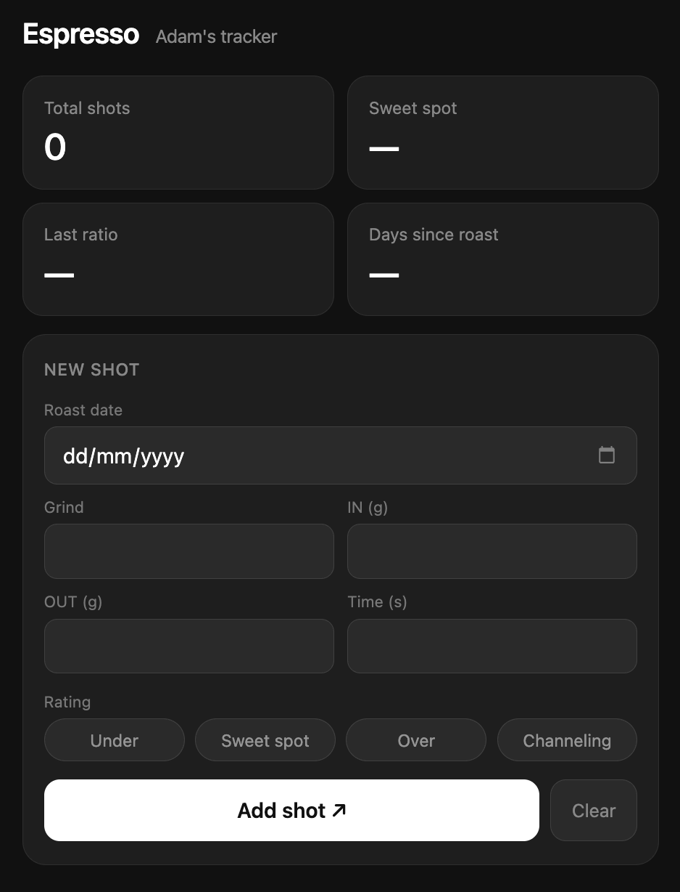

   

# Espresso · Adam's Tracker

A minimal dark-mode web app for logging and dialing in espresso shots. Built for mobile — add to your iPhone Home Screen and use it like a native app.

## Features

- Log grind setting, dose in, dose out, and time for every shot
- Rate each shot — Under, Over, Optimal, Channeling
- Days since roast calculated automatically
- All data stored locally on your device
- Works offline after first load

## How to Use

**On iPhone**
1. Open [adamscoffee.netlify.app](https://adamscoffee.netlify.app) in Safari
2. Tap Share → Add to Home Screen
3. Use it as a standalone app — no login, no account, saves the history aswell

**On desktop**
Open the `.html` file directly in any browser or visit the hosted link.

## Self-hosting

1. Download `espresso-tracker.html`
2. Or self-host: go to [app.netlify.com/drop](https://app.netlify.com/drop) and drag and drop the file

## Stack

- **Vanilla HTML/CSS/JS** — zero dependencies
- **localStorage** for persistent shot history and roast date

## My Setup

- Grinder - Eureka Mignon 55s
- Machine - De'Longhi La Specialista Arte (EC9155) 
- Recipe - 16g freshly roasted beans IN → 32g OUT · I am personally aiming for 25-26s 
- Storage - Fellow Atmos 

## License

Made with coffee companion (no sh*t sherlock) <a href="https://github.com/adamstefanik">Adam Samuel Štefánik</a>.
